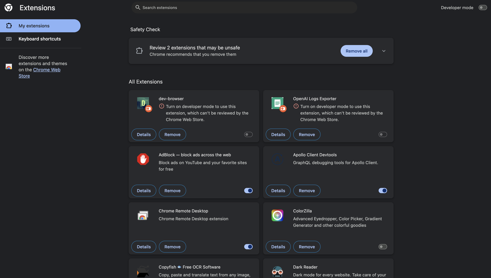
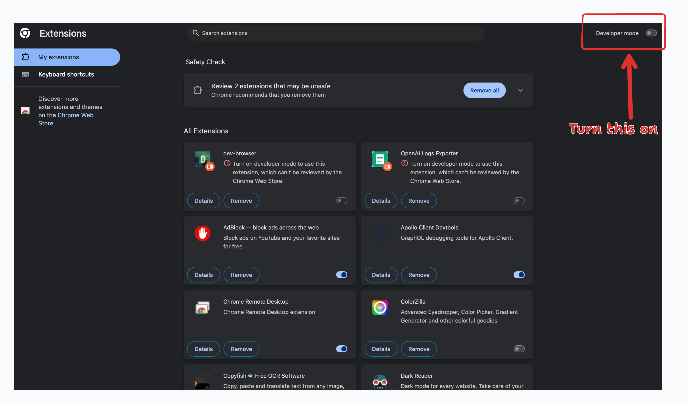
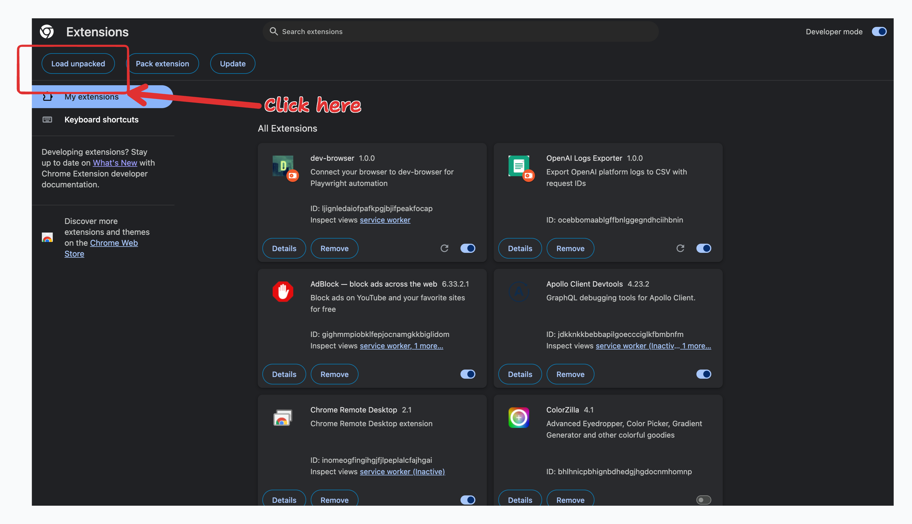
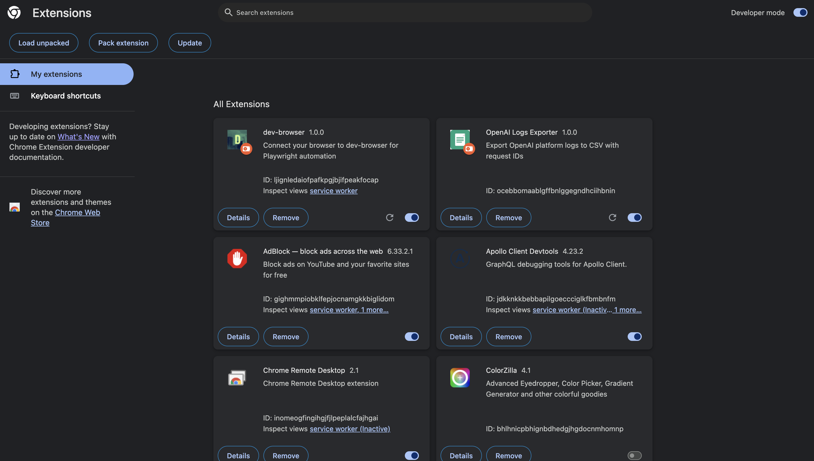
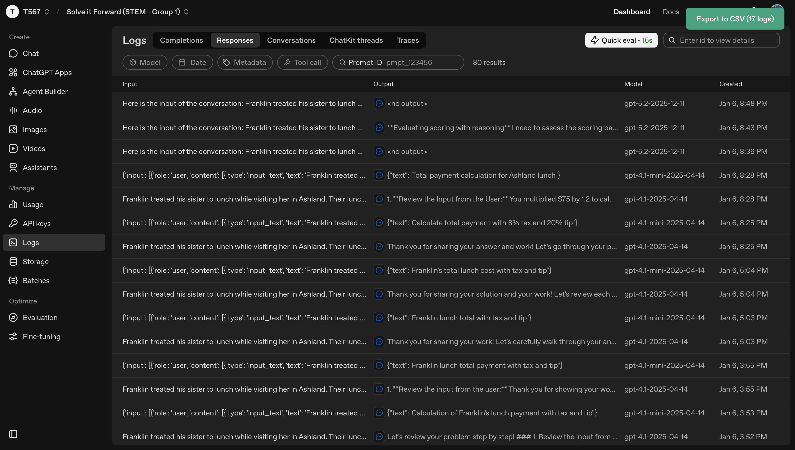
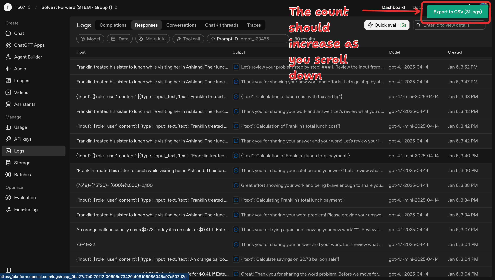

# OpenAI Logs Exporter 📊

A Chrome extension that exports OpenAI platform logs to CSV format. Automatically collects and deduplicates logs as you browse, making it easy to download your conversation history for analysis or backup.

## ✨ What Does This Do?

This extension adds an "Export to CSV" button to your OpenAI logs page. When you click it, all your conversation logs are downloaded as a CSV file that you can open in Excel, Google Sheets, or any spreadsheet program.

**Features:**
- ✅ Automatically collects logs as you scroll through the page
- ✅ Keeps track of all logs you've seen (no duplicates!)
- ✅ Shows you how many logs have been collected
- ✅ Downloads everything to a CSV file with one click
- ✅ 100% private - nothing is sent to any servers

## 📥 Installation Guide

### Step 1: Download the Extension

1. **[Click here to download the extension](../../raw/main/openai-logs-exporter-v1.0.0.zip)** ⬇️
2. Once downloaded, **unzip the file** (double-click it on Mac, right-click → Extract on Windows)
3. Remember where you saved the unzipped folder!

### Step 2: Open Chrome Extensions Page

1. Open Google Chrome
2. In the address bar, type: `chrome://extensions/`
3. Press Enter

### Step 3: Enable Developer Mode

1. Look for the **"Developer mode"** toggle in the top-right corner
2. Click it to turn it **ON** (it should turn blue)

### Step 4: Load the Extension

1. Click the **"Load unpacked"** button (appears after enabling Developer mode)
2. A file browser window will open
3. Navigate to the unzipped folder you downloaded in Step 1
4. Select the folder and click **"Select"** (or "Open")

### Step 5: Verify Installation

You should now see "OpenAI Logs Exporter" in your list of extensions!

## 🎯 How to Use

### Step 1: Go to Your OpenAI Logs

1. Open Chrome and go to: https://platform.openai.com/logs
2. Sign in with your OpenAI account if needed
3. You'll see a green **"Export to CSV"** button appear in the top-right corner

### Step 2: Browse Your Logs

1. Scroll through the page to load all the logs you want to export
2. Watch the button update as it collects logs
3. The extension is collecting all the logs you see!

> **⚠️ Important:** If you switch to a different project/group in OpenAI, **refresh the page** (F5 or Cmd+R) to reset the log counter. This ensures you're only exporting logs from the current project.

### Step 3: Export to CSV

1. When you're ready, click the **"Export to CSV"** button
2. A file will be downloaded automatically
3. The file will be named something like: `openai-logs-2026-01-07.csv`

### Step 4: Open Your File

1. Go to your Downloads folder
2. Open the CSV file in:
   - **Excel** (Windows/Mac)
   - **Google Sheets** (Upload the file)
   - **Numbers** (Mac)
   - Or any spreadsheet program

## 📋 What's in the CSV File?

The CSV file contains 5 columns:

| Column Name | Description | Example |
|-------------|-------------|---------|
| **Request ID** | Unique ID for each conversation | `resp_06e17eee3cb8...` |
| **Input** | What you asked the AI | `"What is photosynthesis?"` |
| **Output** | What the AI responded | `"Photosynthesis is..."` |
| **Model** | Which AI model was used | `gpt-4.1-2025-04-14` |
| **Created** | When the conversation happened | `Jan 6, 3:27 PM` |

## ❓ Troubleshooting

### The export button doesn't appear
- Make sure you're on the correct page: `https://platform.openai.com/logs`
- Try refreshing the page (press F5 or Cmd+R)
- Check that the extension is enabled in `chrome://extensions/`

### The button says "0 logs"
- Wait a few seconds for logs to load on the page
- Try scrolling down to see more logs
- Make sure you have logs in your OpenAI account

### The CSV file looks weird when I open it
- Make sure you're opening it with a spreadsheet program (Excel, Google Sheets)
- If using Google Sheets: Go to File → Import → Upload the CSV file

### I want to export ALL my logs (more than what's showing)
- Scroll down slowly to load more logs
- Wait for the counter to stop increasing
- The extension captures all logs as they appear on screen

## 🔒 Privacy & Security

**This extension is 100% safe and private:**
- ✅ Only works on the OpenAI logs page
- ✅ Does NOT send any data to external servers
- ✅ All processing happens in your browser
- ✅ Does NOT store any data after you close the page
- ✅ Open source - you can see exactly what it does

## 💡 Tips

- **Export regularly**: Download your logs often so you don't lose them
- **Scroll slowly**: Give the page time to load all logs before exporting
- **Check the count**: Make sure the number shown matches what you expect
- **Keep the CSV file**: Save it somewhere safe for future reference

## 📝 Technical Details

For technical users:
- Built with vanilla JavaScript (no dependencies)
- Uses Chrome Extension Manifest V3
- Collects logs from DOM every 1 second
- Deduplicates by Request ID using a Map
- Exports to RFC 4180 compliant CSV format

## 🆘 Need Help?

If you're having trouble:
1. Try the troubleshooting section above
2. Create an issue on this GitHub repository

---

Made with ❤️ for the AI community
